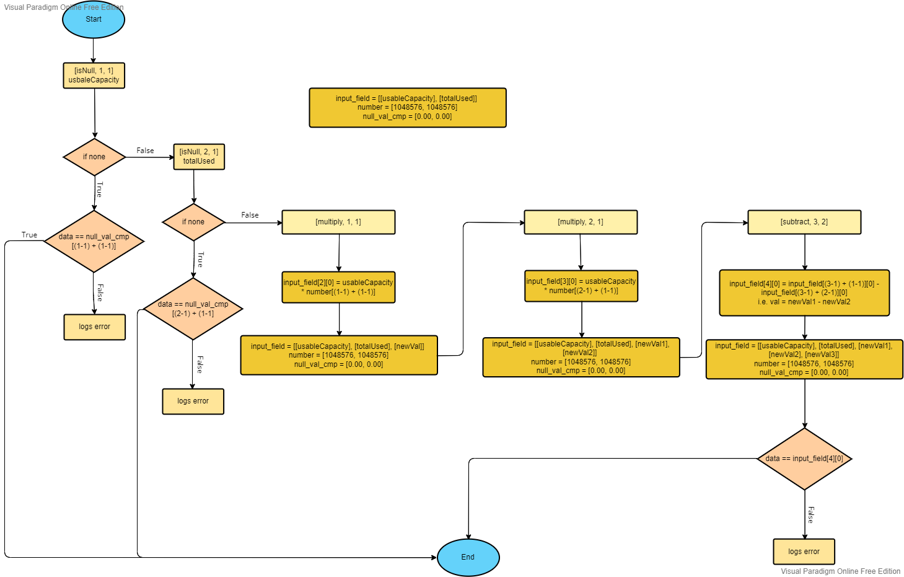
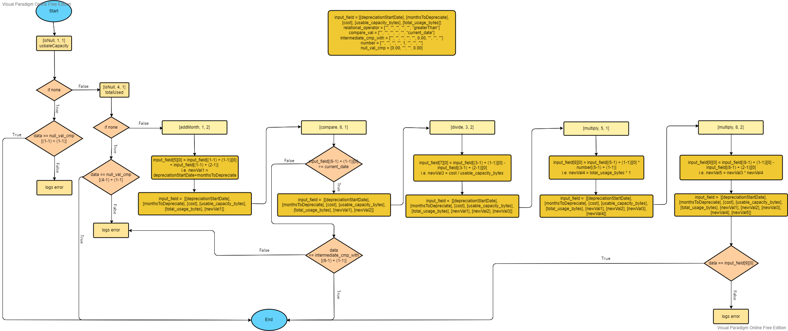

# Avro Validator

## Description

Validating actual output using the AVRO schema plus rules specified in schema itself
In metadata under the field name validator all the rules are specified 

## Content:
- [Install](#Install)

- [Setup](#setup)

- [Explanation](#explanantion)

- [Aggregators](#aggregators-availbale)

- [Complex Example](#complex-example)

- [Languages & tools](#languages--tools)

<hr>

## Install
Python Version: **Python 3.1**

```
pip install fastavro
pip install python-dateutil
```

<hr>

## Setup

```
$ git clone https://github.hpe.com/koshal-agrawal/AvroValidator
$ cd dt1/performance
$ python main.py
```

**To validate any new dataSet:**

* All the required input and output files should be made available in folder named **data**
* The name of the output file should be exactly **output.json** which should be present inside data folder
* Avro schema and rules should be specified in a file named **output.avsc**
* All the key in avro schema should be inlcude in **main.py** in this fashion
```
fastavro.write.LOGICAL_WRITER["<avro_type>-<logical_type>"] = idValueMatch
fastavro.read.LOGICAL_READERS["<avro_type>-<logical_type>"] = decode 
```

**For Example**
```
{
    "name": "customer_id",
    "type": {
        "type": "string",
        "logicalType": "customer_id"
    }
}
```

For the above example it will be:
```
fastavro.write.LOGICAL_WRITER["string-customer_id"] = idValueMatch
fastavro.read.LOGICAL_READERS["string-customer_id"] = decode 
```
<hr>

## Explanantion
### Validator
```
"validator": {
    "aggregator": [["directMapping", 1, 1]],
    "input_field": [["id"]],
    "input_filepath": ["data/volumesDt2.json"],
    "null_val_cmp": [""],
    "number": [2134, "", 213],
    "relational_operator": ["greaterThan", "lessThan", "equalTo", "isNotEqualTo"],
    "logical_operator": ["and", "or"],
    "countCompare_val": [2],
    "compare_val": [""],
    "output_cmp_with": [true, false]
}
```

**'aggregator'** is a list of list which contains all the operation to be performed. <br> 
A single list length should be three where each element means: 
* Operation Type
* Value to be used from which index of input_field 
* How many values to be considered from input_field from the index defined previously

**'input_field'** is a list of list where a list represent the fields from a single input file corresponding to same index level at input_filepath <br>

**'input_filepath'** is a list consisting of all required input files.

**'null_val_cmp'** is a list of values used for comparison with output value if the specified input field is null or none.

**'number'** is a list of values which are used when aggregator such as add, subtract, multiply and divide are mentioned. It is not a mandatory key.

**'relational_operator'** is a list which can contain "greaterThan", "lessThan", "equalTo" or "isNotEqualTo". The input_field value is compared using any of the operator mentioned with the value from 'compare_val'. 

**'logical_operator'** is a list which can contain "and", "or". The two input field values are operated using the mentioned operator. If more than two input fields are to be used then it computes using the previous result & one input field.

**'countCompare_val'** is a list of values which is used when 'countCompare' aggregator is called in which we specify a condition and keep the count of that condition being true. Later compare the count with this value.

**'compare_val'** is a list of values which is used when doing comparison either in case of 'directCompare' or 'compare'.

**'output_cmp_with'** is a list of value used with comparison with outptu value based on the result of condition.


**NOTE**<br>
- Wherever any values are to be used with an aggregator it should be placed in accordance with the index specified in those aggregator. 
- In between if no values are there to use then those can be denoted using empty string. 
- After computation whatever the result is obtained is added at the end of the input_field.

<hr>

### Aggregators availbale
* passing
* directCompare
* directMapping
* isNull
* add
* subtract
* multiply
* divide
* compare
* countCompare
* logicalCompare
* epochConverter
* addMonth

To use any of these aggregator it should be included under the field validator in avro schema <br>
You can find the explanation for each aggregator below

### **passing**
For no any validation<br> 

*Example*
```
"validator": {
    "aggregator": [["passing"]]
}
```

### **directCompare**
Output field to be validated against a particular value or set of values<br> 

compare_val: contains the value or set of values

*Example*
```
"validator": {
    "aggregator": [["directCompare"]],
    "compare_val": [true]
}
```

### **directMapping**
Output field to be matched with anyone of the input field from a input file <br> 

*Example*
```
"validator": {
    "aggregator": [["directMapping", 1, 1]],
    "input_field": [["id"]],
    "input_filepath": ["data/volumesDt2.json"]
}
```

Here in above example, it will check if the output value of field under which this validator is defined is same as the input field 'id' from the input file volumesDt2.json <br>

### **isNull**
To check what the output value should be if input value for that field is null or none <br> 

*Example*
```
"validator": {
    "aggregator": [["isNull", 1, 1]],
    "input_field": [["name"]],
    "input_filepath": ["data/systemsDt2.json"],
    "null_val_cmp": [""]
}
```

Here in above example, it will check if field 'name' from file 'systemsDt2.json' is null or none if so then the output value will be compared with the corresponding index value at null_val_cmp

### **add**
Performs addition between different input_field and number<br>

*Example*
```
"validator": {
    "aggregator": [["add", 1, 2]],
    "input_field": [["size", "total_usage_bytes"]],
    "input_filepath": ["data/volumesDt2.json"],
    "number": [100]
}
```

Here in above example, the value of 'size' and 'total_usage_bytes' from file 'volumesDt2.josn' and the value '100' will be added. Now the obtained value will be compared with the output value

If we don't want any extra number to be added then we can remove the key 'number' from validator.

*Similarly, the aggregators **subtract** (the first value is added after that subtracted from that value), **multiply** and **divide** can be used.*

### **compare**
Compares the input_value with the value under field compare_val using comparison operator mentioned in relational_operator of validator

*Example*
```
"validator": {
    "aggregator": [["compare", 1, 1]],
    "relational_operator": ["equalTo"],
    "input_field": [["thinly_provisioned"]],
    "input_filepath": ["data/volumesDt2.json"],
    "compare_val": [true],
    "output_cmp_with": ["Thin", "Thick"]
}
```

Here in above example, the value of 'thinly_provisioned' from input file 'volumesDt2.json' is checked if it is equal to 'true'. If condition matches then the output value is compared with output_cmp_with[0] i.e. 'Thin' else output_cmp_with[1] i.e. 'Thick'

### **countCompare**
Compares the input_value with the value under field compare_val using comparison operator mentioned in relational_operator of validator if condition matches then count is increased after that this count is compared with countCompare_val

*Example*
```
"validator": {
    "aggregator": [["countCompare", 1, 1]],
    "relational_operator": ["isNotEqualTo"],
    "input_field": [["downstream_partner_id"]],
    "input_filepath": ["data/scheduleListDt2.json"],
    "countCompare_val": [2],
    "compare_val": [""],
    "output_cmp_with": [true, false]
}
```

Here in above exmaple, the value of 'downstream_partner_id' from input file 'scheduleListDt2.json' is checked if it is not equal to "" this then the count is increased. After that the count is compared with 'countCompare_val' i.e. 2. Now, if the condition satisfies then the output value is checked against output_cmp_with[0] i.e. true else with output_cmp_with[1] i.e. false

### **logicalCompare**
Compares the input_field value using operator mentioned in logical_operator

*Example*
```
"validator": {
    "aggregator": [["compare", 1, 1], ["compare", 2, 1], ["logicalCompare", 3, 2]],
    "relational_operator": ["greaterThan", "equalTo"],
    "logical_operator": ["and"],
    "input_field": [["replicationPartnerCount", "replicationTraffic"]],
    "input_filepath": ["data/VC.json"],
    "compare_val": [1, "Receiving"],
    "output_cmp_with": [true, false]
}
```

Here in above exmaple, first the value of field 'replicationPartnerCount' and 'replicationTraffic' from input file 'VC.json' are compared for greater than equal to '1' & equal to 'Receiving' and their boolean result are stored at the end of input_field. Now those two values computed are operated using 'and' operator. If it gives true then output value is compared with output_cmp_with[0] i.e. true else with output_cmp_with[1] i.e. false

### **epochConverter**
Converts the input value date into epoch time i.e. no of milliseconds from 1st Jan, 1970

Input value format should be atleast :- %Y-%m-%d %H:%M:%S Eg:- 2022-07-05 10:17:18

*Example*
```
"validator": {
    "aggregator": [["epochConverter", 1, 1]],
    "input_field": [["collectionTimeUTC"]],
    "input_filepath": ["data/volumesDt2.json"]
}
```

Here in above example, the field 'collectionTimeUTC' from file 'volumesDt2.json' is converted into epoch time and compared with ouptut value.

### **addMonth**
Adds the number of months taken from index+1 of input_field to input value date.

Input value format for date should be atleast :- %Y-%m-%d %H:%M:%S Eg:- 2022-07-05 10:17:18

*Example*
```
"validator": {
    "aggregator": ["addMonth", 1, 2]],
    "input_field": [["costDetails-depreciationStartDate", "costDetails-monthsToDepreciate"]],
    "input_filepath": ["data/cost.json"],
}
```

Here in above example, the value of field 'costDetails-monthsToDepreciate' gets added to 'costDetails-depreciationStartDate' from input file 'cost.json' and the obtained new date is compared with the output value.

## Complex Example
```
"validator": {
    "aggregator": [["isNull", 1, 1], ["isNull", 2, 1], ["multiply", 1, 1], ["multiply", 2, 1], ["subtract", 3, 2]],
    "input_field": [["usableCapacity", "totalUsed"]],
    "input_filepath": ["data/capacity.json"],
    "number": [1048576, 1048576],
    "null_val_cmp": [0.00, 0.00]
} 
```


<br>

```
"validator": {
    "aggregator": [["isNull", 1, 1], [isNull, 4, 1], ["addMonth", 1, 2], ["compare", 6, 1], ["divide", 3, 2], ["multiply", 5, 1], ["multiply", 8, 2]],
    "relational_operator": ["", "", "", "", "", "greaterThan"],
    "input_field": [["depreciationStartDate", "monthsToDepreciate", "cost"], ["usable_capacity_bytes"], ["total_usage_bytes"]],
    "input_filepath": ["data/cost.json", "data/systemsDT2.json", "data/volumesDt2.json"],
    "compare_val": ["", "", "", "", "", "current_date"],
    "number": ["", "", "", "", 1, "", "", ""],
    "intermediate_cmp_with": ["", "", "", "", "", 0.00, "", "", ""],
    "null_val_cmp": [0.00, "", "", 0.00]
}
```


<br>

## Languages & tools

- [Python](https://www.python.org/)

- [Apache Avro](https://avro.apache.org/)

- [fastavro](https://fastavro.readthedocs.io/en/latest/)